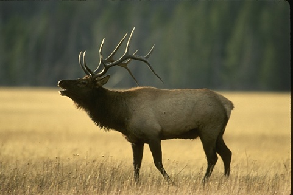
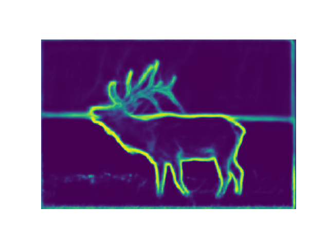
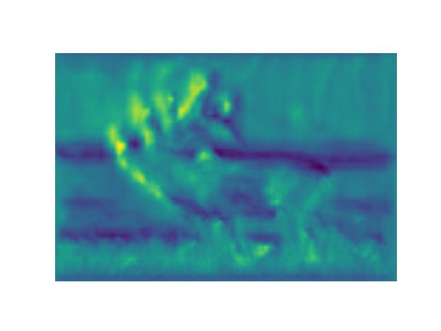
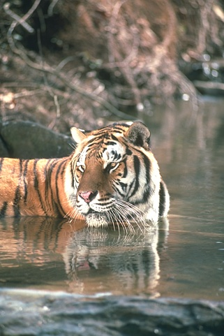
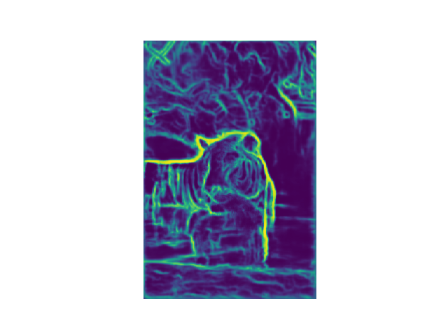
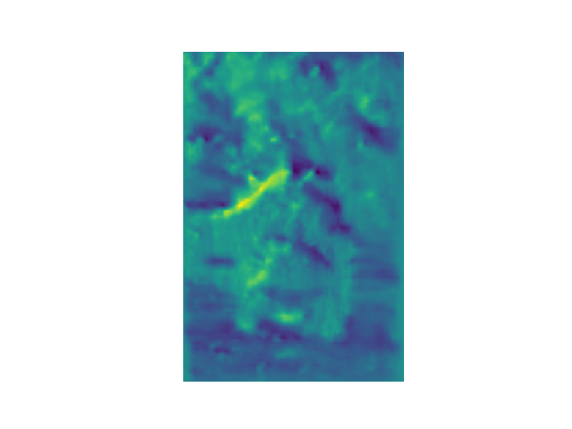

# DOC-tf
Implementation of Deep Occlusion Estimation in Tensorflow along with associated border ownership experiments

The program is written in Python 3 using Tensorflow. For more details about the border ownership experiments, please see the following reference:

    @inproceedings{Hu_etal19CISS,
        Title                    = {Figure-ground representation in deep neural networks},
        Author                   = {Hu, Brian and Khan, Salman and Niebur, Ernst and Tripp, Bryan},
        Booktitle                = {IEEE CISS-2019 53rd Annual Conference on Information Sciences and Systems},
        Year                     = {2019},
        Address                  = {Baltimore, MD},
        Organization             = {IEEE Information Theory Society},
        Pages                    = {1-6},
        Doi                      = {10.1109/CISS.2019.8693039}
    }

## DOC: Deep OCclusion Estimation From a Single Image

This repository is based on the Caffe model found [here](https://github.com/pengwangucla/DOC). The goal was to convert this model to Tensorflow for further network dissection and experimentation.

## Model Conversion

The first step is to get the Caffe model weights and prototxt definition files. They can be found [here](https://drive.google.com/file/d/0B7DaWBKShuMBN0drTzRRMlpoTmc/view). I first tried converting the model from Caffe to Tensorflow using the [caffe-tensorflow](https://github.com/ethereon/caffe-tensorflow) tool. Unfortunately, many layers (including Crop and Deconvolution) are not properly implemented. I then came across the [MMdnn](https://github.com/Microsoft/MMdnn) tool from Microsoft, which allows for conversion of models between different frameworks (e.g. Tensorflow, Caffe, Pytorch, etc.) I adapted the code there after running into the following issues (my fork of the code is [here](https://github.com/brianhhu/MMdnn)):

1. I didn't want to install Caffe just to do the conversion, so I used a pure protobuf implementation. You have to uncomment out the corresponding lines in the mmdnn/conversion/caffe/resolver.py file to fallback on a protobuf implementation.

2. The converter expects the crop layer to have an output shape, which is missing from the .prototxt file. I just commented out the crop layers in the .prototxt file.

3. The converter expects the deconvolution layer to have a dilation parameter, which is missing from the .prototxt file. I just set it to 1 by default in the mmdnn/conversion/caffe/shape.py file (similar to other layers).

4. There was also an issue with computing the max size of the output layers, since the output prediction is a zero-dim numpy scalar. I edited mmdnn/conversion/caffe/graph.py to check for zero-dim numpy scalars.

Following these steps resulted in a numpy (.npy) file containing the network weights, and a python (.py) file containing the model graph definition. These are denoted **doc.npy** and **doc.py** for the orientation estimation network and **hed.npy** and **hed.py** for the boundary detection network, respectively. This was tested on Python 2.7 with Tensorflow 1.8.

## Tensorflow Graph

The final output Tensorflow graph (\*.py file) had a few extra "L"s in the shape components, which I had to manually delete before the python file could be run without errors. I also had to go in and change the shapes of some of the layers to allow for arbitrary input image sizes (it was hard-coded to 500x500 before). The main changes were making the input layer accept arbitrary dimension images and using a padding size of 1 instead of 35. Also, in the deconvolution layers, I checked for the input image size dynamically and used "SAME" padding instead of "VALID" padding.

## Example Inference

You can pass an arbitrary image to the model and get the model's edge and/or orientation outputs. For example, to get the boundary detection output:

```python
# Boundary detection on image 41004
python tensorflow_inference.py -n hed -w model/hed.npy -i img/41004.jpg

# Orientation estimation on image 108041
python tensorflow_inference.py -n doc -w model/doc.npy -i img/108041.jpg
```

## Example Output

| Original                 |  Edge                     | Orientation |
:-------------------------:|:-------------------------:|:-------------------------:
             |         | 
            |        | 


This was tested on Python 3.6 with Tensorflow 1.8. You will also need to install pillow (for image loading) and matplotlib (for plotting results).
